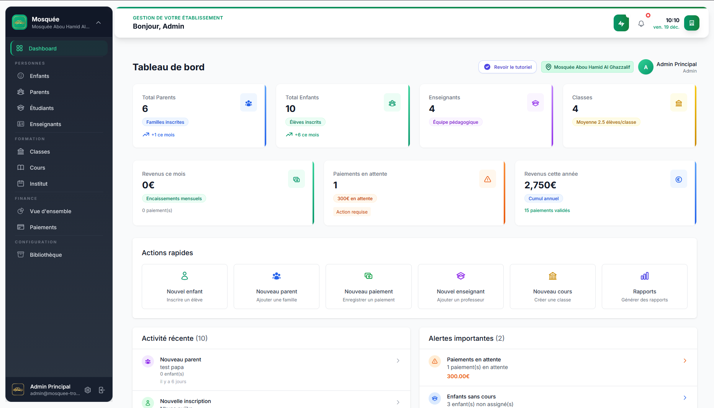
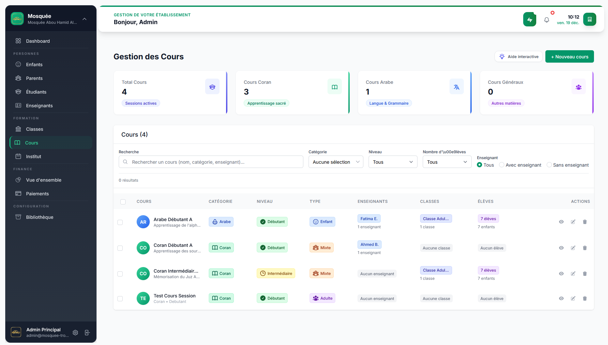
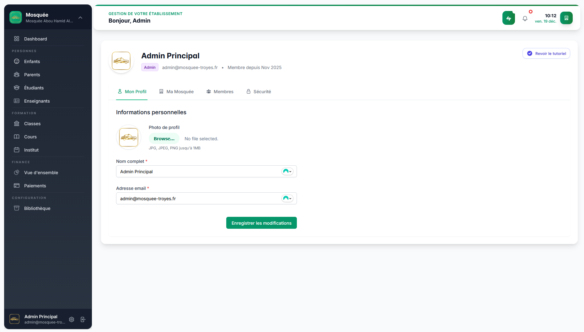
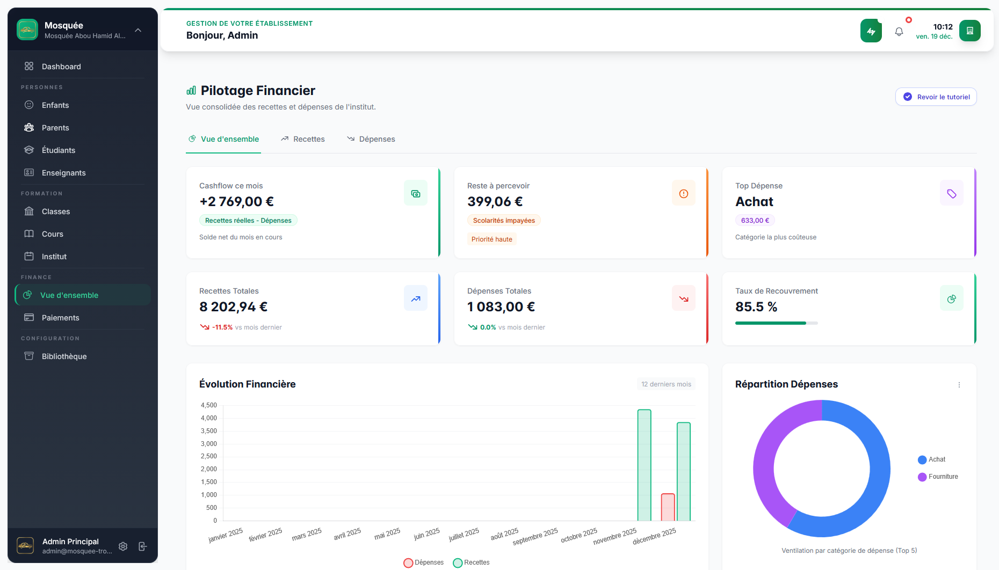

# CNX – SaaS Communautaire & Éducatif  
## Mosquedu.com

🔗 Plateforme : https://mosquedu.com

Mosquedu est une **plateforme SaaS communautaire complète** destinée à la
**gestion d’instituts, associations, mosquées et organismes de formation**,
opérant **en ligne et en présentiel**.

La solution agit comme un **ENT (Environnement Numérique de Travail)**,
intégrant :
- gestion administrative
- gestion pédagogique
- facturation & paiements
- gestion des membres et utilisateurs
- rôles avancés par organisme

Une **application mobile** est prévue dans la roadmap produit.

---

## 🖼️ Aperçu de la plateforme

> Captures issues de l’interface web  
> (données sensibles et comptes réels non exposés)

---

## 🎯 Vision Produit

Mosquedu vise à **digitaliser et centraliser** la gestion des structures
communautaires et éducatives, souvent confrontées à :
- des outils dispersés
- une gestion manuelle
- un manque de visibilité globale

La plateforme apporte une **solution unique, structurée et sécurisée**,
adaptée aux réalités terrain.

---

## 👥 Typologies d’Utilisateurs & Rôles

### 🧑‍💼 Comptes Organisation
- Administrateur de l’organisme
- Gestionnaires
- Enseignants / formateurs

### 👨‍👩‍👧‍👦 Comptes Utilisateurs
- Adultes
- Étudiants
- Enfants
- Membres / adhérents

Chaque rôle dispose :
- de permissions spécifiques
- d’interfaces dédiées
- d’un périmètre fonctionnel adapté

---

## 🧩 Fonctionnalités Clés

### 🏢 Gestion des Organismes
- Multi-organismes (SaaS multi-tenant)
- Paramétrage spécifique par structure
- Séparation stricte des données

### 📚 Gestion Pédagogique
- Création et gestion des cours
- Gestion des classes et groupes
- Affectation enseignants / élèves
- Suivi des sessions et présences
- Accès différencié aux contenus

### 💳 Facturation & Paiements
- Facturation automatisée
- Abonnements et paiements récurrents
- Paiements en ligne sécurisés
- Historique des paiements
- Gestion des statuts (payé, en attente, impayé)

### 👤 Gestion des Membres
- Inscription et onboarding
- Profils utilisateurs
- Rôles et permissions
- Historique d’activité

---

## 🏗️ Stack Technique

- **Backend** : Laravel
- **Frontend** : Blade, Alpine.js
- **Assets & build** : Vite
- **Architecture** : MVC & SaaS multi-tenant
- **Sécurité** : Auth, rôles & policies Laravel

---

## 📄 Documentation

- [Architecture & conception SaaS](docs/architecture/overview.md)

---

## 🔒 Confidentialité

Ce repository présente la plateforme d’un point de vue
fonctionnel et architectural.
Le code source, les données utilisateurs et les configurations
sensibles ne sont pas exposés.
